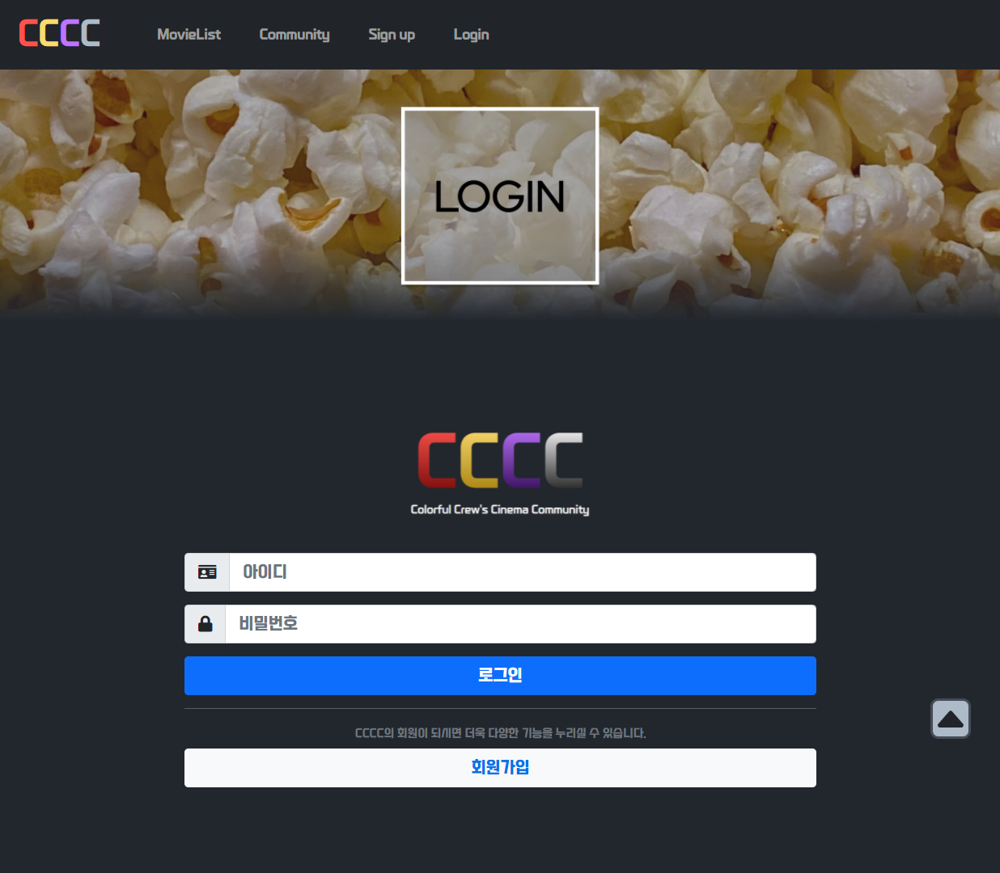

## 🎬 CCCC, Colorful Crew's Cinema Community 🎬

### 📌 SSAFY 보안 서약에 따라 소스 코드 공개가 제한됩니다. 이에 기능과 결과만 간략히 정리하여 공유합니다. 📌

### ⅰ. Introduction

---

CCCC는 좋아하는 색상을 통해 영화를 추천 받는 사이트입니다

사용자가 선호하는 색상을 선택하면, 해당 색상을 좋아하는 유저들이 좋아하는 영화를 추천해줍니다.

유저들은 레후아 레드, 몽구스 옐로우, 포포로 바이올렛 3가지 그룹으로 분류 되며, 그룹에 따라 아바타, 닉네임 색상이 다르며, 영화 추천도 다르게 받습니다.

자신과 비슷한 취향을 가진 사람에게 영화를 추천받고, 추천하며 유저는 커뮤니티와 그룹에 소속감을 느낄 수 있습니다.

CCCC에서 취향에 꼭 맞는 영화를 찾고, 사람들과 즐거운 시간을 보내보세요

### ⅱ. Features

---

- 관리자뷰를 통한 앱 전체 관리
  - admin site를 통해 영화 등록, 수정, 삭제 가능
  - 가입 유저들 정보 관리 가능
- 영화 정보 제공
  -  TMDB에서 제공하는 개봉 날짜, 장르, 줄거리, 평점 각 영화의 디테일 페이지로 전달
  -  영화에 대한 리뷰 등록 / 수정 / 삭제 기능 구현
- 유저 그룹에 따른 영화 추천 알고리즘 구현
  - 회원 가입 시 선택한 색상이 유저 본인의 그룹 ➡ 해당 그룹 평점을 기반으로 한 영화 추천
    - 리뷰 생성시 작성된 평점을 해당 유저의 그룹 평점에 반영
    - 전체 영화 리스트가 생성될 때 유저의 그룹 평점이 높은 순서대로 배열(2순위: TMDB)
    - 비회원 유저 접속 시 TMDB 평점 순 정렬
  - 유저가 회원정보에서 색상을 바꿀 경우 변경된 색상 기반으로 추천 알고리즘 변경
- 커뮤니티 기능
  - 영화 전체 리스트에 있는 영화에 대해 리뷰 작성할 수 있는 커뮤니티
  - 로그인 후 리뷰 조회 및 생성, 본인 글 수정 및 삭제 가능
  - 각 게시글과 댓글 생성 및 수정 시각 정보 포함

- 기타
  - HTTP Method와 상태 코드 적절히 반환  ➡ 에러 발생 시 메시지 확인
  - 유저 프로필 페이지  ➡ 본인이 작성한 리뷰 개수 등 정보 확인 가능
  - 회원 프로필 페이지 ➡리뷰 작성한 회원의 프로필 페이지 조회 가능 (팔로우 가능)

### iii. Result

---

##### Index

---

#### Sign up

---

 ##### Login

---

##### Make Reviews

---

##### MovieList

---

* 디바이스 크기에 따라 다른 화면 출력

##### Community

---

##### URL
---
***http://ssfay-final-pjt.s3-website.ap-northeast-2.amazonaws.com/*** (만료됨)

##### 추후 발전방향
---

1. S3 서버 증설로 이미지 처리능력 향상
2. 소셜 로그인 기능 구현
3. 그룹별 경쟁 이벤트 도입 : 리뷰가 많은 그룹에게 아바타 등의 특전 제공으로 사용자들의 소속감 높임

